# prueba_nach

Aplicación que permite generar una lista de usuarios y asignación de tareas mediante el uso de php,javascript moderno (ES6) y mysql.

## Requisitos.

Tener WAMPSERVER instalado en windows.

Tener instalada la ultima versión de NODE.JS.

Tener instalado composer.

Tener instalado visual studio code.

Tener instalado postman 

Conexión a internet para bajar los programas.

## Descarga e instalación de la aplicación.

Ejecutar los siguientes comandos.

Paso 1: Clonar el repositorio usando git.

```nginx
git clone https://github.com/LuisFer27
```

Paso 2 :Abrir visual studio code.

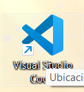

Paso 3: ejecutar en la terminal los siguientes comandos una vez descargado el proyecto

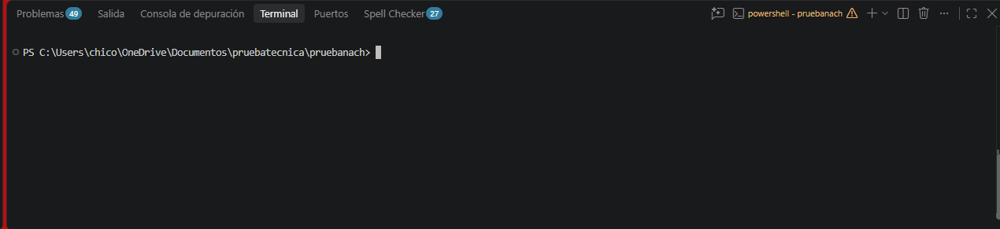

```console
composer install ##sirve para instalar los elementos generales para el funcionamiento del proyecto

npm install ##sirve para instalar todas las dependencias de npm para el funcionamiento

php artisan serve ##para poder ejecutar el proyecto
```

paso 4: ejecutar wampserver si esta instalado en el equipo es necesario ejecutarlo ya que puede servir con xampp o cualquier otro programa parecido sin embargo empleamos wampserve para versiones recientes una vez abierto ahora si podemos proseguir con la ejecución de nuestros comandos.

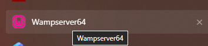

paso 5 crearemos una base de datos mediante wamp usando localhost/phpmyadmin o cualquier gestor de bd sin embargo usaremos phpmyadmin como ejemplo
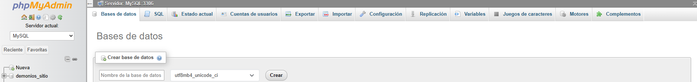
y la llamaremos prueba 
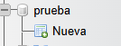

Paso 6: ejecutaremos los siguientes comandos para generar los archivos que se irán a migración .

```console
php artisan make:migration create_users_table --create=users
php artisan make:migration create_tasks_table --create=tasks
php artisan make:migration add_deleted_at_to_tasks_table --table=tasks    
```

como resultado se nos mostrara estas tablas
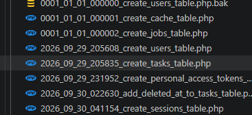

y solo se ajustaran con esta configuración 
Tabla users
```php
<?php

use Illuminate\Database\Migrations\Migration;
use Illuminate\Database\Schema\Blueprint;
use Illuminate\Support\Facades\Schema;

return new class extends Migration
{
    /**
     * Run the migrations.
     */
    public function up(): void
    {
        Schema::create('users', function (Blueprint $table) {
            $table->id();
            $table->string('name');
            $table->string('email');
            $table->timestamps();
        });
    }

    /**
     * Reverse the migrations.
     */
    public function down(): void
    {
        Schema::dropIfExists('users');
    }
};

```
Tabla Task
```php
<?php

use Illuminate\Database\Migrations\Migration;
use Illuminate\Database\Schema\Blueprint;
use Illuminate\Support\Facades\Schema;

return new class extends Migration
{
    /**
     * Run the migrations.
     */
    public function up(): void
    {
        Schema::create('tasks', function (Blueprint $table) {
            $table->id();
            $table->foreignId('user_id')->constrained('users')->onDelete('cascade');
            $table->string('title');
            $table->string('description');
            $table->boolean('completed')->default(false);
            $table->timestamps();
        });
    }

    /**
     * Reverse the migrations.
     */
    public function down(): void
    {
        Schema::dropIfExists('tasks');
    }
};


```
y esta migracion adicional ya aunque el ejercicio no lo menciona se agrego softdeletes la tabla de tasks ya que se quiere evitar eliminar todo y tener un historico
como resultado se nos mostrara estas tablas


```php
<?php

use Illuminate\Database\Migrations\Migration;
use Illuminate\Database\Schema\Blueprint;
use Illuminate\Support\Facades\Schema;

return new class extends Migration
{
    public function up(): void
    {
        Schema::table('tasks', function (Blueprint $table) {
            $table->softDeletes();
        });
    }

    public function down(): void
    {
        Schema::table('tasks', function (Blueprint $table) {
            $table->dropSoftDeletes();
        });
    }
};

```
y despues se ejecutara el siguiente comando para hacer la migración a mysql

```console
php artisan migrate ##comando que sirve para ejecutar las migraciones a mysql
```
Paso 7:para generar un token se genera un nuevo usuario es necesario tener uno creado ya que esto se realizara dentro de my sql de ahí para la asignación del token se hara del siguiente modo 

abrir la terminal de vs code

se ejecutara tinker 
php artisan tinker

de ahí se metera en el mismo tinker el siguiente comando
```php
$user = App\Models\User::find(1);
```
el find permite colocar el usuario que quieres uno colocarle el token .

de ahí se genera la insercion que es esta
```php
$token = $user->createToken('api-token')->plainTextToken;
```
ya que esta funcion permite gener ar el token y poder meter el mismo en el env .

Paso 8:para generar usuarios se realiza mediante el uso de postman ya que lo ideal es usar seeders sin ebargo en este caso se opto por un uso en json ya que la configuración inicia por abrir el programa

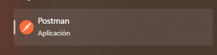
despues nos conectaremos al enlace ede esta forma 
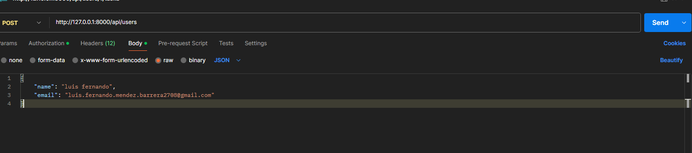
al final nos aparecera el resultado de la siguiente forma 
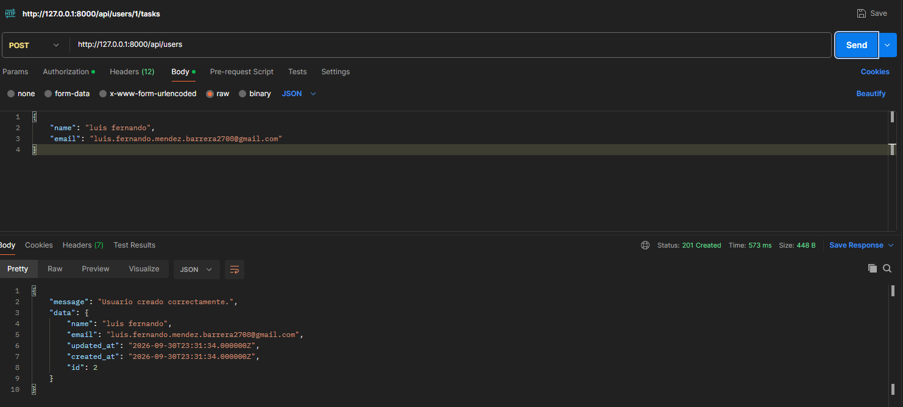
para configurar postman se creara 
en 
Athorization en la opcion del desplegable le daremos en bearer y colocaremos el token generado
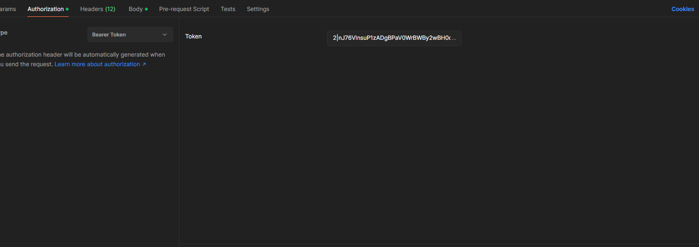
y de ahí en body crearemos apartados nuevos llamados Authorization en donde ira nuestro token 
en content-type ira el tipo de aplicacion que es application/json y Accept del mismo modo application/json
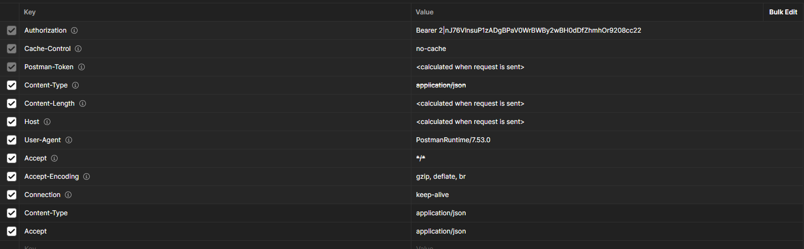


## configuración de env .

Para configurar el entorno de desarrollo se tiene que generar los siguientes parametros que es lo siguiente con el fin de conectar a la tabla de mysql.

```console
DB_CONNECTION=mysql
DB_HOST=127.0.0.1
DB_PORT=3306
DB_DATABASE=prueba
DB_USERNAME=root
DB_PASSWORD=
DB_CHARSET=utf8mb4
DB_COLLATION=utf8mb4_unicode_ci
```

db connection hace referencia a la conexión del tipo que es mysql
db host hace referencia al host que se configurara ya que puede ser localhost o iniciar en 127.0.0.1
db port hace referencia a la salida y el puero por donde saldra la conexion
db database hace referencia ala base de datos que se esta empleando para hacer la inserción importante ya que esta se genera antes de poder hacer las migraciones
db username es el nombre de usuario asignado ya que se puede generar otro mediante la creacion de usuarios pero para este ejemplo se uso root
db password se coloca la contraseña ya que es visible sin embargo para este ejemplo no se coloca ya que no tiene contraseña 

Adicionalmente agregaremos otro apartado en nuestro env para validar la configuración de todo el apartado y es para nuestra autenticación ya que esto se ajustara en el archivo app.php ubicado en la carpeta config.
```php
    'maintenance' => [
        'driver' => env('APP_MAINTENANCE_DRIVER', 'file'),
        'store' => env('APP_MAINTENANCE_STORE', 'database'),
    ],
'tasks_api_token' => env('TASKS_API_TOKEN'),
```
y así quedaria esto configurado en nuestro programa 

```console
TASKS_API_TOKEN=3|VgLJ4MuHwMxgnCdmJ8tiVR3MmRZRZXob5h3Yg0TFd084cbf0
```
## ejecución y funcionamiento .

se ejecutara usando
```console
php artisan serve
npm run dev
```
y accediendo a la liga 

http://127.0.0.1:8000/tasks

y una vez accediendo se nos abrirá el programa en donde seleccionaremos un usuario y podemos crear una nueva tarea ya que con el selector podemos escoger un usuario
también se nos mostrará una lista en donde estarán las tareas del usuario
en donde podremos eliminarlas y dar por completadas 
al igual vienen los filtros de forma alfabética y por fecha para mejor entendimiento en el programa
y finalmente tenemos los campos de titulo de tarea y descripción donde podremos guardar una tarea nueva y almacenarla 
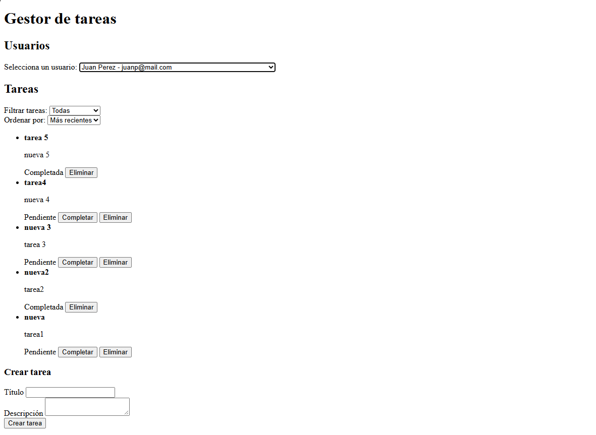
